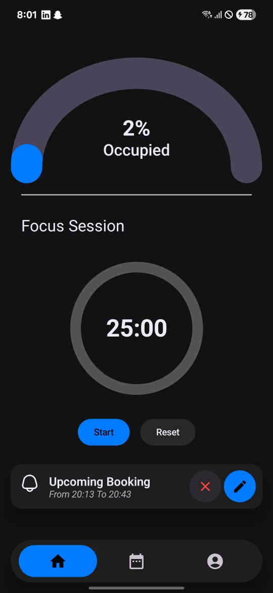
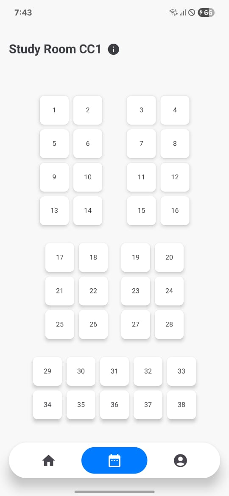
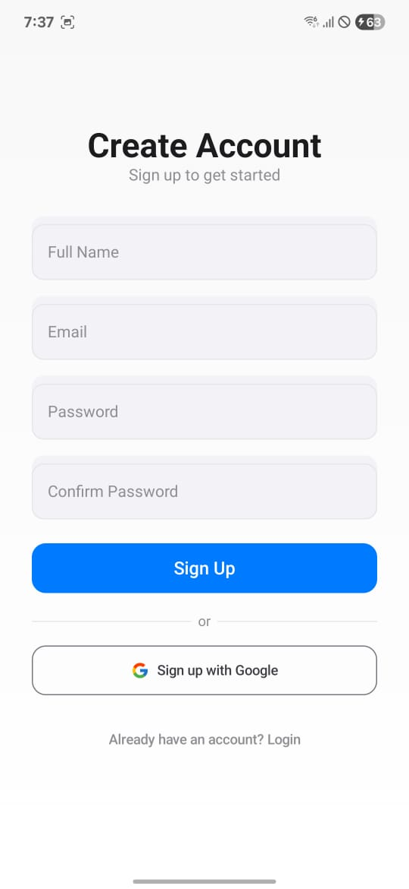

# 📚 Spaces – Study Room Booking App

**Spaces** follow a clean MVVM (Model–View–ViewModel), designed to streamline the process of booking study rooms in educational institutions. It provides real-time seat availability, allowing students to reserve study spaces efficiently.

## 🚀 Features

- **Real-Time Seat Availability**: View current occupancy status of study rooms.
- **User Authentication**: Secure login and registration for users.
- **Room Booking**: Reserve available study rooms with ease.
- **Booking History**: Track past and upcoming reservations.
- **Notifications**: Receive alerts for booking confirmations and reminders.

## 🛠️ Tech Stack

- **Language**: Kotlin
- **Architecture**: MVVM (Model-View-ViewModel)
- **UI**: Jetpack Compose
- **Backend**: Firebase Firestore & Firebase Authentication
- **Other Tools**: Gradle, Android Studio

## 📸 Screenshots
### 🏠 Home Screen

### 🪑 Booking Screen

### 🔐 Signup Screen

### Profile Screen

## 📂 Project Structure
| Layer       | Observed Component                                                                 |
|-------------|-------------------------------------------------------------------------------------|
| **Model**   | Firebase models like `Seat`, `Booking`, etc. in `data/`                            |
| **View**    | Composables under `ui/screens` and `ui/components` that reflect UI logic           |
| **ViewModel** | Classes in `viewmodel/` that handle UI logic, state, and interact with the data layer |
| **Navigation** | Centralized screen routing using Jetpack Compose Navigation in `navigation/`    |

## 🧑‍💻 Author

**Arshnoor**

- 📧 Email: arshnoorb7@gmail.com
- 🔗 LinkedIn: [linkedin.com/in/arshnoor7](https://www.linkedin.com/in/arshnoor7)
- 💼 GitHub: [github.com/nxxr-07](https://github.com/nxxr-07)

## 📄 License

This project is licensed under the MIT License - see the [LICENSE](LICENSE) file for details.

